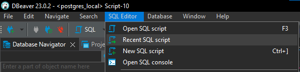
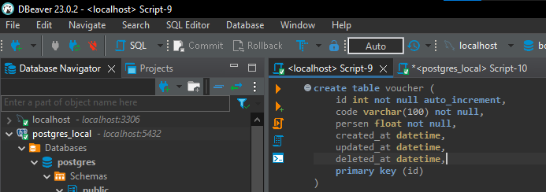
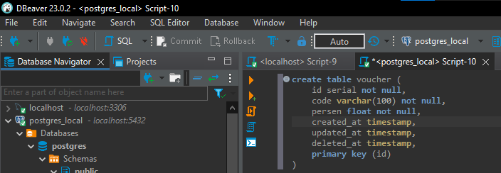

# Create Table in MySQL or PostgreSQL

This directory is for storing the SQL code used to create the tables in MySQL or PostgreSQL that are required in this repo

## Prerequisite

- DBBeaver (RDBMS)
- MySQL or PostgreSQL

## Usage

Copy each code from code number 1 to end from MySQL or PostgreSQL folder in DBeaver or another RDBMS, and then execute it.

